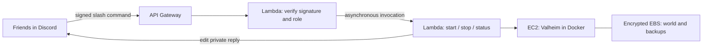

# Valheim on AWS, controlled from Discord

Clone this project:

```sh
git clone https://github.com/omniphx/valheim-discord-server.git
cd valheim-discord-server
```

Run one Valheim VM for your friends. Start it from Discord when you want to play; stop it when you finish. The world stays on a separate encrypted EBS disk. Clone this repository, supply your own AWS and Discord settings, and deploy your own copy.

| Command | Result |
| --- | --- |
| `/valheim start` | Starts the VM; allow several minutes for Valheim to load or update. |
| `/valheim stop` | Requests normal OS shutdown so Valheim can save, then stops compute. Disconnects everyone. |
| `/valheim pause` | Alias for stop. This is not hibernation or an in-game pause. |
| `/valheim status` | Shows VM state, current IP address, and the crossplay join code when available. |

Replies are visible only to the person invoking the command. Every command requires a configured role in the configured Discord server, including for administrators. The password is shared separately with players.



The controller runs on demand and remains reachable when EC2 is stopped. There is no always-running bot VM, NAT gateway, load balancer, or reserved public IP. This is a single-server setup, not high availability.

## Requirements

- An AWS account and CLI v2 profile with permissions to manage EC2/VPC/EBS, IAM roles and policies, Lambda, API Gateway, CloudWatch Logs, and SSM parameters. Terraform needs `iam:PassRole` for the roles it creates. Use a deployment identity you control, never credentials in the repository.
- Node.js 22+, npm, Terraform 1.7+ (mock-provider tests require 1.7), and Python 3. Terraform 1.14.8 is used in CI.
- Permission to manage applications/integrations in your Discord server.
- A Valheim game client for each player. Set `crossplay = true` for Xbox / Microsoft Store players.

## 1. Sign in to your own AWS account

Create a named profile separate from any work or old-project profile. Recent AWS CLI versions support browser login:

```sh
aws login --profile personal --region us-east-2
aws sts get-caller-identity --profile personal
export AWS_PROFILE=personal
export AWS_REGION=us-east-2
```

Verify that the account ID is your intended account before provisioning. For IAM Identity Center, use `aws configure sso --profile personal` and `aws sso login --profile personal` instead. See [AWS CLI login](https://docs.aws.amazon.com/cli/latest/userguide/cli-configure-sign-in.html). If your Terraform SDK does not support login credentials, use the documented `credential_process` compatibility profile; do not paste exported credentials into this repository.

The default region is Ohio (`us-east-2`), a geographic starting point for a US group spread across NC, TX, CO and CA. Test actual latency with your group. AWS's standard [region list](https://docs.aws.amazon.com/global-infrastructure/latest/regions/aws-regions.html) does not offer a US Central region. Choose the region **before** deployment: EBS volumes cannot simply move between regions or Availability Zones.

## 2. Create the Discord application and player role

1. In the [Discord Developer Portal](https://discord.com/developers/applications), create an application. Copy its **Application ID** and **Public Key** from General Information.
2. Create a bot for this application and obtain its token. You will use the token locally only to register commands; the deployed controller does not store or need it.
3. Configure a **Guild Install**, with the `bot` and `applications.commands` scopes. No administrator bot permission or privileged Gateway intents are needed. Use the portal's install link to add the application to your server.
4. Enable Discord Developer Mode. Copy your server ID and the ID of a role such as **Valheim Players**. Assign the role to yourself and your friends.
5. Later, after registration, open **Server Settings → Integrations → your application** and allow that role to use `/valheim`. The command starts disabled for ordinary members. Both Discord's command permissions and the handler's role allowlist must permit access.

The crossplay join code is read from the running game's session logs through a fixed, read-only SSM document. It is checked on each status request because it can change after a restart. If the game is starting, crossplay is disabled, or its code cannot be read, status says **unavailable** and still shows the VM address. Only logs from the current game process are considered. No additional public ports are opened.

Discord sends [signed HTTP interactions](https://docs.discord.com/developers/interactions/receiving-and-responding). The receiver checks the signature and a five-minute timestamp window, checks the application/server/roles, queues the work, and returns a private deferred response. The worker edits that response with the result. Discord requires the initial acknowledgement within three seconds; AWS cold starts or throttling can occasionally cause a timeout. Check status before repeating an uncertain lifecycle action.

## 3. Configure and build

From your clone's root:

```sh
npm ci
npm test
npm run build
cp infra/terraform.tfvars.example infra/terraform.tfvars
```

Edit `infra/terraform.tfvars` with the Discord values. These IDs and public key are not secrets. The example also exposes region, VM size, world name, crossplay and allowed game-network CIDRs. For multiple independent deployments use separate directories/state and unique `name` values; IAM names are account-wide. Each deployment should use its own Discord application.

Create the password as an SSM **SecureString** in the deployment region, using the default AWS-managed SSM key:

```sh
python3 scripts/set-password.py --profile personal --region us-east-2
```

The script prompts without echoing the password. It passes the password through a mode-0600 temporary file that is removed after use, not through command arguments, and prints only parameter metadata. Use at least five characters, no newlines, and a password distinct from the server name. For a different parameter path, pass `--name /your-project/server-password` and set the matching Terraform variable. A custom KMS key would also require adding explicit decrypt permission to the VM role.

Terraform never reads the password value. At each service start the VM fetches it into a root-only file under `/run`; the container reads it through `SERVER_PASS_FILE`. To rotate the password, rerun the helper, then stop and start the VM.

## 4. Review and deploy

```sh
terraform -chdir=infra init
terraform -chdir=infra validate
terraform -chdir=infra test
terraform -chdir=infra plan -out=deploy.tfplan
terraform -chdir=infra apply deploy.tfplan
terraform -chdir=infra output
```

`apply` creates billable resources and initially starts the VM. This repository does not deploy through GitHub Actions. Do not use Terraform apply as a start/stop control; use Discord or EC2.

Set the Discord application's **Interactions Endpoint URL** to the `interactions_endpoint` output and save. Discord validates the URL with a signed PING.

Register the commands from the project root. In bash/zsh, `read -s` accepts the bot token without putting it in shell history:

```sh
export DISCORD_APPLICATION_ID='your-application-id'
export DISCORD_GUILD_ID='your-server-id'
read -rs DISCORD_BOT_TOKEN
export DISCORD_BOT_TOKEN
npm run register
unset DISCORD_BOT_TOKEN
```

Press Enter after pasting the token into the silent prompt. Grant the role command access in Discord Integrations. Registration updates `/valheim` by name and preserves unrelated commands in the application.

Join using the address returned by `/valheim status` and the password. The server is not listed publicly by default. Its public IP is released on stop and can change on start; use the latest address. Initial Steam installation takes several minutes. Crossplay players can use the join code returned by `/valheim status`.

## Crossplay and portal items

Set `crossplay = true` in `terraform.tfvars` to enable the PlayFab crossplay backend. Supported PC and console clients must run compatible game versions. Crossplay players can use the public address or the join code in the game logs; local/loopback IPs are not supported by the crossplay backend.

Set `allow_portal_items = true` to pass ore and other restricted items through portals. This adds only `-modifier portals casual`, preserving the other difficulty settings. The game persists world modifiers in the save: later setting the variable to false stops applying the flag but does not clear an already-saved modifier; reset it using Valheim's world-modifier UI if needed. See the [official dedicated-server guide](https://valheim.com/support/a-guide-to-dedicated-servers/).

## Cost and performance

Stopping removes EC2 compute charges once the VM is **stopped**. It retains **both** disks: a 16 GiB root disk and a 30 GiB world disk. EBS, any snapshots you create, and controller/log usage can still incur charges. The automatic IPv4 address is released on stop, avoiding an idle Elastic IP charge. See [EC2 stop/start behavior](https://docs.aws.amazon.com/AWSEC2/latest/UserGuide/Stop_Start.html).

For an illustrative estimate, using AWS's listed `t3a.large` rate of $0.0752/hour, IPv4 at $0.005/hour, and an assumed regional gp3 rate of $0.08/GiB-month:

| Monthly VM runtime | Compute + IPv4 | 46 GiB disks | Subtotal |
| --- | ---: | ---: | ---: |
| 0 hours | $0.00 | $3.68 | $3.68 |
| 40 hours | $3.21 | $3.68 | $6.89 |
| 80 hours | $6.42 | $3.68 | $10.10 |
| 730 hours | $58.55 | $3.68 | $62.23 |

These are estimates, not an account quote: confirm Ohio pricing in the [AWS calculator](https://calculator.aws/). They exclude data transfer, Lambda/API Gateway, CloudWatch, snapshots, taxes and credits. Sources checked September 2026: [T3/T3a pricing](https://aws.amazon.com/ec2/instance-types/t3/), [IPv4 pricing](https://aws.amazon.com/vpc/pricing/), [gp3 pricing examples](https://aws.amazon.com/ebs/pricing/).

The default `t3a.large` provides 2 vCPUs and 8 GiB RAM. CPU credits use **standard** mode to avoid surplus-credit charges; sustained CPU load can exhaust credits and cause throttling. Stopped instances do not earn credits. Check CPU utilization and `CPUCreditBalance` if play becomes sluggish. `t3a.medium` costs less but has only 4 GiB RAM. Heavy worlds, mods or many players may need a larger or non-burstable instance (which requires extending the instance-type validation). There is no automatic idle shutdown: someone must use stop after playing. An AWS Budget alert is useful for a forgotten running VM.

## Operations, persistence and recovery

Access the host through **EC2 → Connect → Session Manager**, or install the AWS Session Manager CLI plugin and run:

```sh
aws ssm start-session --region us-east-2 --target "$(terraform -chdir=infra output -raw instance_id)"
```

On the host:

```sh
sudo cloud-init status --long
sudo systemctl status valheim
sudo journalctl -u valheim -n 100 --no-pager
sudo docker logs --tail 100 valheim
sudo df -h /srv/valheim
```

Session Manager is available after boot and requires the VM to be running. No SSH port is opened. Only UDP 2456–2457 is exposed for gameplay; restrict `allowed_game_cidrs` if all friends have known public IPv4 ranges. Crossplay uses relay networking as described in the [container documentation](https://github.com/community-valheim-tools/valheim-server-docker).

The world is under `/srv/valheim/config/worlds_local`; game binaries are under `/srv/valheim/data`. The filesystem is selected by the world volume ID, not an assumed NVMe device number. The service requires the world mount, so an absent data disk cannot silently create a fresh world on the root disk. Normal shutdown asks Docker to allow 120 seconds for the game to exit. AWS can still force a stuck shutdown: keep backups and verify that the saved world survives your first stop/start cycle.

The upstream container makes hourly local backups, capped at seven days / 168 archives in `/srv/valheim/config/backups`. **Those backups share the world disk** and do not protect against disk deletion or account loss. For an independent recovery point, stop the VM, wait for `stopped`, then create an EBS snapshot:

```sh
aws ec2 wait instance-stopped --region us-east-2 --instance-ids "$(terraform -chdir=infra output -raw instance_id)"
aws ec2 create-snapshot --region us-east-2 --volume-id "$(terraform -chdir=infra output -raw world_volume_id)" --description 'Valheim world backup'
```

The `world_name` setting selects a save; it does not set the generation seed. For a specific seed, create a world with that seed in the game client and transfer its save while the server is stopped. Keep the previous world under its original name to switch back. Valheim 1.0 stores migrated worlds in directories containing `.fwl2`, `.db2`, and chunk files; preserve the entire directory when backing up or transferring these worlds.

Snapshots are billed separately; wait for completion before destructive maintenance. To restore a local archive, first `sudo systemctl stop valheim` on the running host, copy the current `.db` and `.fwl` files somewhere safe, inspect the ZIP paths, then restore the matching pair from the same backup to `config/worlds_local`. Preserve file ownership and use the matching `world_name`; restart with `sudo systemctl start valheim`. Do not extract over a live world. To recover a lost disk, create a volume from a snapshot **in the VM's Availability Zone**, reconcile/import it into Terraform's `aws_ebs_volume.world` resource, and update the attachment/bootstrap reference during a planned recovery. Do not initialize a blank disk over your only saved world.

Container and game updates: the image defaults to `latest` for approachable setup, but Docker keeps its locally cached image until you pull a new one. Pin `container_image` to a published digest for repeatable container releases. The container independently updates Steam game binaries, so a digest does not freeze the game version. Back up before maintenance. Host packages/bootstrap are installed on first launch. Terraform ignores later bootstrap edits for existing VMs, so settings changes do not replace the server. For an existing server, update `/etc/valheim.env` through Session Manager and restart `valheim` with systemd; keep the corresponding Terraform variables in sync for future deployments. For example, use `CROSSPLAY=true` and `SERVER_ARGS=-modifier portals casual` for crossplay and ore transport. Routine password rotation needs only a service/VM restart.

## Validation and live acceptance

```sh
npm test
npm run build
terraform -chdir=infra fmt -check -recursive
terraform -chdir=infra validate
terraform -chdir=infra test
```

Python tests check password validation, private temporary-file permissions, and cleanup after success or failure. Run them with `python3 -m unittest discover -s test -p "*_test.py"`. Node tests exercise signed requests, role/guild/application authorization, command behavior, AWS errors and Discord reply retries. Terraform tests use mocked providers to check default safety settings and reject empty role lists / unsupported ARM instances. These tests need no AWS credentials and create no cloud resources. CI runs the same checks.

After deployment, perform the live check that local tests cannot replace:

1. Confirm the Discord endpoint saves successfully and an allowed player can query status.
2. Confirm a player without the role cannot use the command. Even administrator accounts need the role.
3. Join, make a visible world change, disconnect, run stop and wait until status says stopped.
4. Run start, wait for the game to load, use the newly reported address and confirm your world change survived.
5. Check crossplay with an actual non-Steam client if enabled, then stop the server when finished.

A timed-out reply is not proof an action failed: check status. Lambda's asynchronous transport can deliver duplicates; handlers check the current VM state and do not toggle blindly. Concurrent start/stop requests have no fairness guarantee: wait for transitions to finish. A failed normal shutdown is never retried as a forced stop by the controller.

## Removing or sharing the project

Commit the source, lock files, documentation and workflow. Never commit `terraform.tfvars`, Terraform state/plan files, credentials, passwords, bot tokens, generated ZIPs or `node_modules`. Local Terraform state is ignored but still needs a secure backup; for shared infrastructure administration, configure an encrypted remote backend with state locking before collaborating on applies.

The EC2 instance has API termination protection and both the instance and world volume have Terraform `prevent_destroy`. A plain `terraform destroy` will fail intentionally. For permanent removal, first stop, snapshot and verify recovery of the world, then deliberately remove those lifecycle protections, disable API termination protection via an apply, review a destroy plan, and destroy. Retained snapshots and the separately created SSM password parameter continue to exist until you explicitly delete them. Merely deleting this repository does not stop AWS billing.

This repository's code is MIT licensed. Valheim itself and the third-party server container retain their own licensing and terms.
